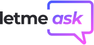
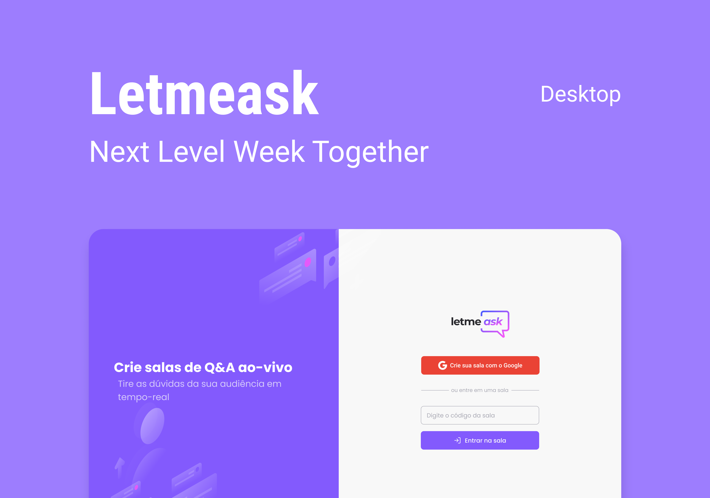

<h1 align="center">
  
</h1>

 

  

## Teste o app online
Link para essa aplicação: [https://letmeask-13eea.web.app](https://letmeask-13eea.web.app)

## Tecnologias

Esse projeto foi desenvolvido com as seguintes tecnologias:

- [React](https://reactjs.org)
- [TypeScript](https://www.typescriptlang.org/)
- [Realtime Database](https://firebase.google.com/products/realtime-database)

## 🚀 NLW Together

Esse projeto foi desenvolvido durante o curso gratuito de ReactJS na semana [NLW Together](https://nextlevelweek.com).

## Projeto

O letmeask é um app que auxilia na interação com sua audiência para responder perguntas.

## Layout

Você pode visualizar o layout do projeto através [desse link](https://www.figma.com/file/kKqwsdD49oav5ZW2yg52h0/Letmeask-Copy). É necessário ter conta no [Figma](http://figma.com/) para acessá-lo.

## Como executar

- Clone o repositório
- Instale as dependências com `yarn`
- Inicie o servidor com `yarn start`

Agora você pode acessar [`localhost:3000`](http://localhost:3000) do seu navegador.
Lembrando que será necessário criar uma conta no Firebase e um projeto para disponibilizar um Realtime Database.

## Extras (desafios do evento)
- Segurança e permissões de acesso
- Responsividade
- PWA (Progressive Web App)

## Licença

Esse projeto está sob a licença MIT. Veja o arquivo [LICENSE](LICENSE.md) para mais detalhes.
